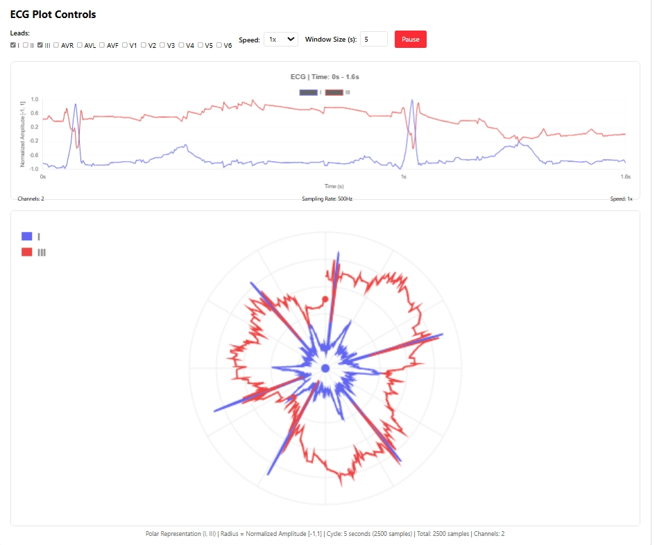
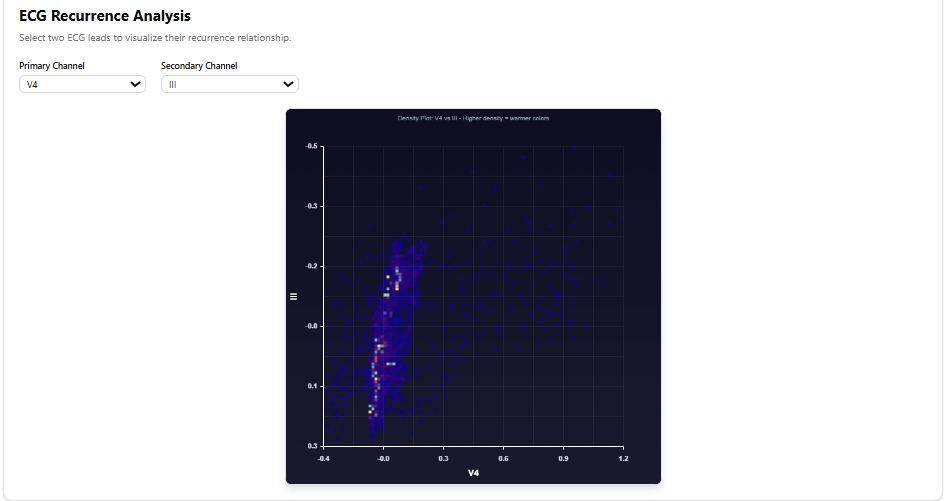
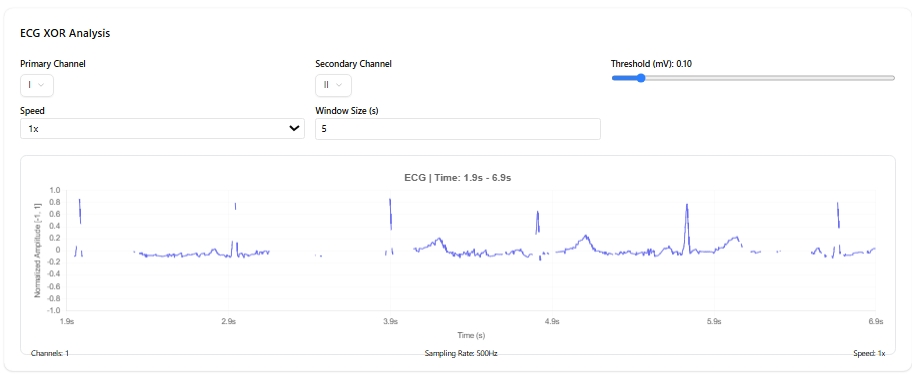

---

## 📚 Table of Contents

- [About the Project](#-about-the-project)
- [Client Overview](#-client-overview)
  - [ECG Analysis](#ecg-analysis)
  - [EEG Analysis](#eeg-analysis)
  - [Doppler Sound Generation](#doppler-sound-generation)
- [Server Overview](#-server-overview)
- [AI Models](#-ai-models)
- [Installation & Setup](#-installation--setup)
- [Contributing](#-contributing)
- [Contributors](#-contributors)
- [Connect with Us](#-connect-with-us)
- [License](#-license)

---

## 🧩 About the Project

The **Signal Intelligence Web Platform** is a comprehensive environment for **interactive signal analysis**, **AI-powered diagnostics**, and **scientific visualization** across multiple signal domains.

It combines advanced processing and modeling capabilities for:

- 🫀 **Biomedical Signal Processing:** Real-time analysis and visualization of ECG and EEG signals.
- ⚙️ **Physics-Based Simulation:** Interactive Doppler effect simulation and synthetic sound generation.
- 🚁 **Drone Classification:** Identification and classification of drone types using AI-driven acoustic and signal features.
- 🛰️ **Synthetic Aperture Radar (SAR) Image Analysis:** SAR-based image creation and interpretation for remote sensing and pattern recognition.
- 🤖 **Deep Learning Integration:** Embedded AI models for prediction, classification, and anomaly detection.
- 📈 **Real-Time Visualization:** Multi-channel signal plotting, recurrence analysis, and polar representations for comprehensive insight.

> 🗒️ **Note:**  
> The project is organized into two main components:
>
> - `client/` — Frontend for visualization and interaction.
> - `server/` — Backend for signal processing, AI inference, and data handling.
>
> Sensitive and large AI model files are excluded from version control using `.gitignore` for privacy and storage optimization.

## 💻 Client Overview

The **client** provides an intuitive interface for visualizing, analyzing, and exploring **multi-channel signals**.  
It includes three major analysis modules.

---

### 🫀 ECG Analysis

**Expected JSON Input Attributes:**

- `signals`: 2D array _(shape: n_samples × n_channels)_
- `leads`: Array of lead names
- `samplingRate`: SamplingRate of the readings

### Features

| **Feature**                                 | **Description**                                                                                                                                                                                                                                    | **Illustration**                                 |
| ------------------------------------------- | -------------------------------------------------------------------------------------------------------------------------------------------------------------------------------------------------------------------------------------------------- | ------------------------------------------------ |
| **Multi-Channel Plotting (Linear & Polar)** | Enables synchronized visualization of ECG signals across multiple leads. Data can be observed in both **linear** (time-domain) and **polar** (phase-space) formats, providing complementary insights into waveform morphology and synchronization. |               |
| **AI-Powered ECG Analysis**                 | Utilizes trained machine learning models to automatically identify and classify potential cardiac abnormalities based on the uploaded ECG data. _(Model files are excluded from version control — see `.gitignore`.)_                              |  |
| **Recurrence Plot (Two-Channel Analysis)**  | Computes and visualizes **recurrence relationships** between two ECG leads, aiding in the detection of nonlinear patterns, rhythmic structures, and cross-channel dependencies.                                                                    |  |
| **XOR Channel Analysis**                    | Performs a **logical XOR** operation between selected ECG channels to highlight waveform discrepancies, phase shifts, or artifacts across different signal paths.                                                                                  |                |

### 🧠 EEG Analysis

**Expected JSON Input Attributes:**

- `signals`: 2D signal matrix _(shape: n_samples × n_channels)_

**Features:**

| Feature                      | Description                                       | Image                                               |
| ---------------------------- | ------------------------------------------------- | --------------------------------------------------- |
| Multi-channel Linear Plot    | Simultaneous EEG waveform visualization           |     |
| Polar Plot Visualization     | Circular representation of multi-channel EEG data |       |
| Recurrence Plot (2 Channels) | Analyze dynamic recurrence between EEG channels   |  |

---

### 🔊 Doppler Sound Generation

**Parameters:**

- Frequency of source
- Velocity of source
- Duration

**Features:**

| Feature                | Description                                                                                          | Image                                                        |
| ---------------------- | ---------------------------------------------------------------------------------------------------- | ------------------------------------------------------------ |
| Amplitude vs Time Plot | Visualize the simulated Doppler signal                                                               |   |
| AI Doppler Prediction  | Predict source frequency & velocity from recorded Doppler signal _(Model excluded — see .gitignore)_ |  |

---

## ⚙️ Server Overview

The **server** manages:

- Signal processing requests (ECG, EEG, Doppler)
- AI inference endpoints
- File handling and normalization

> 🧾 **Notes:**  
> The server handles JSON uploads, 2D signal arrays,  
> and integrates with local AI models (ignored in Git).

---

## 🧠 AI Models

| Model            | Task                              | Location                             | Note           |
| ---------------- | --------------------------------- | ------------------------------------ | -------------- |
| ECG Model        | Cardiac abnormality detection     | `server/models/ecg_model.pkl`        | Ignored in Git |
| Doppler Model    | Frequency & velocity prediction   | `server/models/doppler_model.pkl`    | Ignored in Git |
| Drone Classifier | Drone type classification         | `server/models/drone_classifier.pkl` | Ignored in Git |
| SAR Model        | Synthetic Aperture Radar analysis | `server/models/sar_model.pkl`        | Ignored in Git |

---

## ⚙️ Installation & Setup

```bash
# 1. Clone the repository
git clone https://github.com/<your-username>/<your-repo-name>.git
cd <your-repo-name>

# 2. Install client dependencies
cd client
npm install
npm run dev

# 3. Install server dependencies
cd ../server
pip install -r requirements.txt

# 4. Run the server
uvicorn main:app --reload    # or node index.js
```
